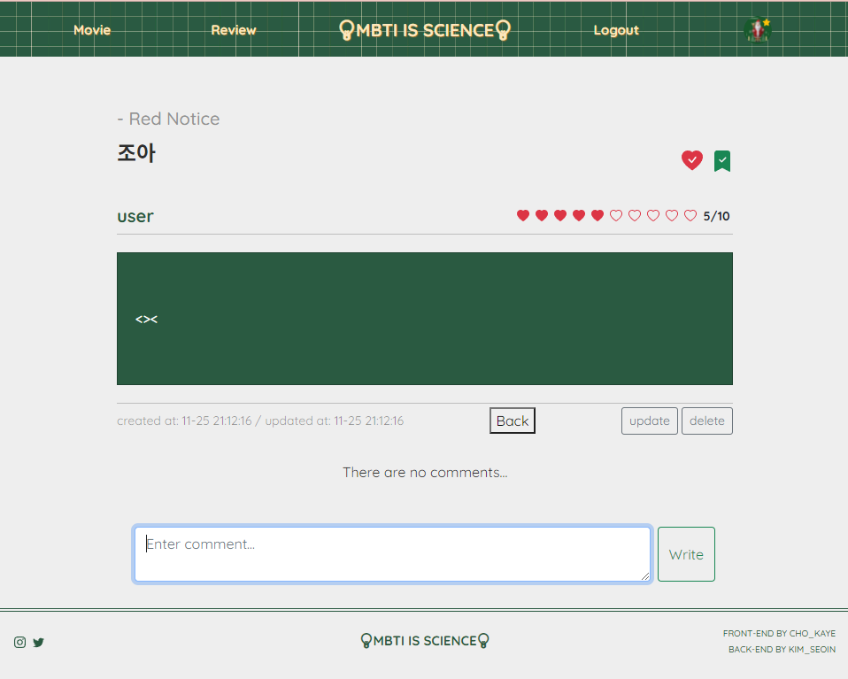
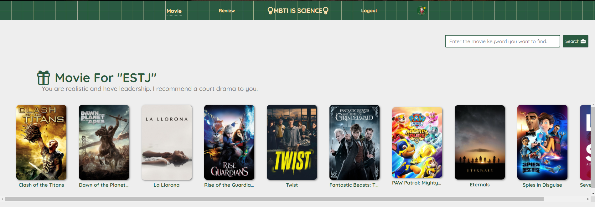

- # MBTI is Science

  ## 1. 팀원 정보 및 업무 분담 내역

  - 김서인: 백엔드 담당(Django API Server. 영화 API를 활용한 Data Seeding, API 가이드)
  - 조가예: 프론트엔드 담당(Bootstrap 5, Vue.js, UI 구현)

  ## 2. 목표 서비스 구현 및 실제 구현 정도

  ### 목표로 삼았고 구현한 서비스

  - 관리자 뷰

  - Movie

    - 영화 검색
    - 영화 리스트 
      - 유저 MBTI 기반 장르 추천 (로그인 후 MBTI 정보 존재할 때만 출력)
      - 현재 날씨 기반 장르 추천 (구미, 부산 등 지역 별 날씨 기반으로 추천 가능)
      - 2000개 영화 목록 ( 별점 오름차순, 내림차순, 최신순, 오래된 순, 찜 많은 순으로 정렬 가능)
      - 영화 정보 10개씩 읽어올 수 있는 pagination 구현. 

    - 영화 정보
      - 제목, 장르, 별점, 줄거리, 포스터, 배우 정보와 추천 영화(tmdb로 연결), tmdb의 리뷰 + 사이트의 리뷰영화 찜하기 (프로필에서 찜한 영화 목록 확인 가능)
      - 제목, 장르, 평점, 줄거리, 포스터, 배우 정보(클릭 시 tmdb의 해당 배우 정보로 이동), 유사한 영화(tmdb API를 이용함. )
      - 영화 찜하기(프로필에서 확인 가능)
      - tmdb에서 해당 영화에 관해서 쓴 리뷰, 본 사이트에서 해당 영화에 관해 쓴 리뷰를 보여줌

  - Account

    - Signup
    - Login
    - User CRUD

  - Community

    - **Article**
      - 게시글 검색
      - 게시글 정렬
        - 최신순 / 오래된순 / 높은 평점순 / 낮은 평점순 / 최다 스크랩순 / 최다좋아요순
      - 게시글 리스트
        - 작성일 / 영화detail 링크 / 게시글 detail 링크 / 댓글 수 / 프로필 링크 (작성자 아바타, 닉네임 ) / 평점 게시글 Detail영화 detail 링크 / 좋아요, 스크랩 토글버튼 및 count / 평점 / 내용 / 작성시간 / 수정시간 / 댓글 리스트, 댓글 폼
      - 게시글 CRUD
        - review create (로그인한 유저만 생성 가능), 리뷰와 함께 평점 매기기 가능
        - review update (본인만 수정 가능)
        - review delete (본인만 삭제 가능)
      - 게시글 좋아요 / 스크랩
        - 좋아요 수는 tmdb vote count + 우리 유저 찜 count 수 반영, 찜한 영화는 본인만 프로필에서 확인 가능
        - 스크랩역시 count 실시간 반영, 스크랩한 영화 본인만 프로필에서 확인 가능
    - Comment
      - 작성자 정보(아바타/닉네임)를 누르면 작성자 프로필로 이동
      - 댓글 내용이 4줄이 넘어갈 시 숨김 기능
      - 생성시각 표시
      - 한 번 작성한 댓글은 수정 불가능.
      - 댓글 CRD
        - review create (로그인한 유저만 생성 가능)
        - review delete (본인만 삭제 가능)

  - Profile

    - use's info

      - 아바타 선택해서 본인 프로필에 반영 가능.(주어진 이미지 여러 개 중 선택)
      - username , mbti 정보
      - 가입 시 MBTI를 설정하지 않았다면 모른다는 표시와 함께 MBTI 검사 페이지로 갈 수 있는 버튼
      - following / follower 수 
      - 본인의 프로필이면 유저 삭제, 업데이트 버튼다른 사람의 프로필이라면 팔로우 / 언팔로우 버튼 출력

    - user’s article

      - 본인만 볼 수 있는 정보: 찜한 영화, 북마크한 게시물
      - 모두가 볼 수 있는 정보: 작성한 댓글, 게시물
      - 8개 이상으로 길어지면 가장 최신 글만 8개까지 출력

      

  - MBTI test

    - MBTI를 약식으로 파악할 수 있는 12개의 문항을 구상함.

    - 영화에 관련된 문항으로 구성함.

    - MBTI 유형, 해당 유형의 영화 캐릭터, 추천하는 영화 장르가 담긴 정보를 제공함.

    - 선택지에 따라 점수를 더하고 빼며 각 항목을 음수와 양수로 판단하여 결과 도출.

    - 결과로 나온 MBTI를 User model에 반영함.

      

  - 영화 추천 알고리즘

    - MBTI(16종류)에 따라 좋아할 만한 영화 장르를 나누고, 해당 영화 장르들의 영화 중 10개를 랜덤으로 제공함.
    - 날씨(온도(추움, 보통, 더움), 하늘 상태(비, 눈, 맑음))에 따라 좋아할 만한 영화 장르를 나눔. 온도와 하늘 상태에 따라서 10개씩 영화를 랜덤으로 제공함.

  - 그 외

    - 메인 화면 상단 Hero

      - 크리스마스 이미지와 함께 추천 영화 (영화 검색 결과 화면) 링크 

      - 크리스마스 관련 영화 이미지, 트레일러 유튜브 영상 모달로 구현

      - MBTI 테스트 이미지, 테스트 페이지 이동 버튼

        

  ### 목표했는데 구현하지 못한 서비스

  - 게시글 댓글 순 정렬
  - 게시글 조회 수 세기
  - 날씨 기반 영화 추천 알고리즘에 미세먼지 API도 이용하기
  - SNS를 활용해서 로그인하는 기능
  - 영화 배우 정보(DB의 actor)를 DB에 저장하여 활용하기.
  - 페이지 크기에 따른 반응형 페이지로 만들고 싶었지만 시간 부족. 적당한 사이즈에서만 구현 가능.
  - Hero 부분에 영상 재생
  - 로그인창 모달로 하고 싶었으나 시간 부족
  - 영화 검색 결과 페이지 정렬 시간 부족
  - 안 쓰는 코드 정리, 주석 달기 시간부족

  

  ## 3. 데이터 베이스 모델링(ERD)

  

  

  ## 4. 필수 기능에 대한 설명

  ### 관리자 뷰

  

  장고의 admin 기능을 이용함.

  관리자 권한의 유저만 유저 관리 권한을 가짐.

  관리자 권한의 유저만 영화, 댓글을 등록, 수정, 삭제할 수 있음.

  

  ### 영화 정보

  

  TMDB API 를 활용해서 영화 데이터(2000개)를 수집, 가공하여 DB에 저장함.

  

  

  

  

  

  로그인한 유저는 영화 평점을 등록, 수정, 삭제할 수 있음.

  

  

  ### 추천 알고리즘

  

  로그인하고 MBTI를 저장한 사용자는 본인의 MBTI에 따라서 영화 추천을 받을 수 있음. (MBTI 별로 선호 장르를 정함. 해당 장르의 영화 중 10개를 랜덤으로 제공함._

  

  

  모든 사용자는 날씨에 따라서 영화를 추천받을 수 있음.  (날씨(온도(추움, 보통, 더움), 하늘 상태(비, 눈, 맑음))에 따라 좋아할 만한 영화 장르를 나눔. 온도와 하늘 상태에 따라서 10개씩 영화를 랜덤으로 제공함.)

  

  날씨의 기준이 되는 지역을 선택할 수 있음.

  

  ### 커뮤니티

  

  

  ## 5. 자료

  - 배포 서버 URL  : https://adoring-bose-8d7f71.netlify.app/
  - 페이지, 컴포넌트 구상: https://drive.google.com/file/d/1sniFZYPOZpw_0_qTxduaY0eZdVff-VDp/view?usp=sharing
  - ERD : https://app.diagrams.net/#G1lYxHpxj51jsypjmoLq8l3rO3PGdqa01l
  - 만든 API: https://seoin.gitbook.io/mbti-is-science_api/reference/api-reference

  ## 6. 소감

  ### 김서인

  

   일주일이 어떻게 지나갔는지 모르겠다!! 집중하다 보면 두 세시간이 빠르게 지나갔다. 그래도 그만큼 집중해서 재미있게 했던 것 같다~!! 전에는 A부터 Z까지 다 알려주신 후에, 그걸 해보면서 익히는 방식이었다면, 최종 관통 프로젝트는 하나 하나 스스로 해야 했다. 전에 배우지 않았던 것도 구현하고 싶어서 열심히 구글링하고, 공식 사이트를 읽어봐야 했다. 그러면서 문제 해결 능력이 자란 것 같다. 어렵고 막히는 부분이 있으면 가예님과 함께 코드를 보고 콘솔창을 들여다 봤다. 

  ​	개발자의 자질 중 끈기, 소통이 정말 중요한 것 같다. 알고 나면 사소한 문제였는데, 그것을 알기 까지 얼마나 많은 시간을 들였는지... 그래도 기억에 남고, 다음부터는 안 틀릴 것 같다..!! vue의 v-display와 v-if, django의 annotate 등 수업으로 배울 때는 잘 이해되지 않았던 부분도 실제로 다루면서 이해가 되었다. 어렵게 느껴졌던 배포, 어색했던 포스트맨과도 친해졌다.

   가예님 덕분에 예쁜 디자인까지 얻은 우리 사이트!! 너무 예쁘다 !! 이번 프로젝트 전에는 백엔드, 프론트엔드 중 하나를 확실히 정하지 못했는데, 프로젝트를 하면서 백엔드 쪽을 하고 싶다고 마음 먹게 되었다. 가예님은 디자인에 열정과 애정이 넘치시는 것 같다!! 그에 비해서 나는 기능이 잘 동작하고, 어느 정도만 예쁘면 된다고 생각한다. 내가 기능만 완성한 곳에 가예님의 손길이 닿고 나면, 마법처럼 예뻐지는 게 신기했다..! 나는 문제인 줄 몰랐던 부분(프로필을 클릭하면, 프로필 사진이 눌려서 보였다. 원래 원형인데 타원형.)에 열정을 가지시고 시간을 들여서 수정하시는 모습도 기억에 남는다. 한 학기를 마무리하면서, 이렇게 멋진 사이트를 만들어서 배포하다니 뿌듯하고 감사하다!!

  

  ### 조가예

  

   전부터 호흡을 맞춰오던 서인님과 함께 최종프로젝트를 하게 돼서 너무 기뻤다! 나는 꽤 고집이 있는 편인데, 내가 뭘해도 좋다고 하시는 서인님 덕분에 많이 배려받으며 원하는 방향으로 마음껏 프로젝트를 진행할 수 있었다. 아직 하고 싶은 기능은 넘쳐나는데 한정된 시간 안에 모든 것을 구현하지 못 해서 아쉬움이 많이 남는다. 처음엔 vuex, router, bootstrap 세 가지를 함께 사용하는 게 너무 헷깔리고 뭐가 뭔지 모르겠고 삐그덕거렸는데 점점 어떤 것들이 무슨 기능을 하는 지 알고 컨트롤 할 수 있게 되니까 훨씬 재밌게 코딩할 수 있었다. 모르는 것들이나 안 배운 것들은 구글링을 하고 공식문서를 읽으면서 찾아내는 재미도 찾았다. 

  물론 계속해서 크고 작은 문제들에 부딪혔다. 특히 데이터쪽에 지식이 너무 부족했기 때문에 혼자서는 제대로된 모델링이나 서버구현을 하지도 못했을 것이라고 생각한다. 서인님이 만든 API와 데이터들을 보면서 많이 배웠다. 데이터에 접근하는 방법도 많이 익힌 것 같다. 내 천재페어 서인님과 함께라면 두려울 것이 없었다. 우리는 언젠간 해결해내리라는 확신이 있었기 때문에 크게 낙심하는 일 없이 무난하게 프로젝트를 마무리할 수 있었던 것 같다. 

  이번 프로젝트를 하면서 지난 몇주간 공부한 것보다 이번에 훨씬 많은 공부를 하게 되었다. 짧게 진행되던 관통 프로젝트에서 아쉬웠던 디자인까지 양껏 할 수 있어서 너무 만족스럽다. 거의 맨날 밤새고 하루에 14~18시간씩 앉아서 코딩만해서 건강이 아주 나빠진 느낌이지만 코딩의 재미를 제대로 느낄 수 있게 됐고 너무너무 뿌듯하다. 

   혼자 공부할 때 서버와 데이터를 설계하는 지식이 전무함에 한계를 느껴서 SSAFY에 지원하게 되었는데, 5개월도 안 되는 시간에 이렇게 멋진 웹사이트를 만들어낸 나 자신이 너무 대견하다. 앞으로도 이렇게 열심히 공부해서 멋진 개발자가 돼야겠다!! 

  Thanks to 김한욱 교수님💜

  Special thanks to 김서인 페어님🧡

  
